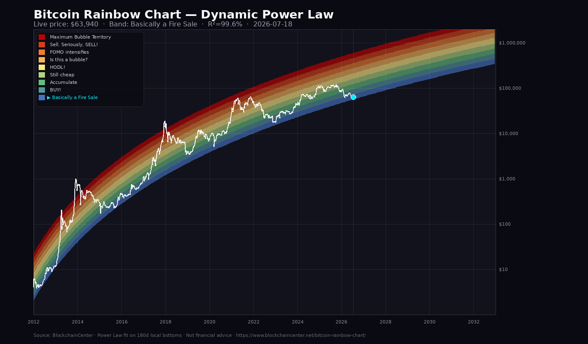

# Bitcoin Rainbow Chart – Dynamic Analysis

> Auto-updated by **Grok Agent** · 2026-07-18T06:32:31Z  
> Source: [https://www.blockchaincenter.net/bitcoin-rainbow-chart/](https://www.blockchaincenter.net/bitcoin-rainbow-chart/)

## What is the Bitcoin Rainbow Chart?

The **Bitcoin Rainbow Chart** is a logarithmic chart of Bitcoin’s full price history,
overlaid with colored bands (the “rainbow”) that mark relative valuation zones along
a long-term growth curve.

It began as a Reddit meme (2014, user *azop*) and was turned into a live tool by
[BlockchainCenter](https://www.blockchaincenter.net/bitcoin-rainbow-chart/). It is **not a scientific forecasting model** and
**not financial advice**. It helps zoom out from daily volatility and place the current
price in multi-year cycle context.

The **Dynamic** version fits a **Power Law** regression in real time on price history
(using 180-day local bottoms), with fit strength commonly reported around **94%+ R²**
on the source site.

---

## Live data (from BlockchainCenter)

| Field | Value |
|-------|--------|
| BTC price (USD) | **$63,940.00** |
| BTC price (EUR) | €55,903.00 |
| Change 24h | +1.69% |
| Change 7d | -0.29% |
| Market cap (USD) | $1,282,548,531,518 |
| ATH | $126,080 (2025-10-06) |
| As of | 2026-07-18 |

### Current band position

| Model | Current band |
|-------|--------------|
| **Dynamic Power Law** | **Basically a Fire Sale** |
| Original (log regression) | Bitcoin is dead |

- Dynamic formula: `Price = 10^(5.7695 * log10(days) + -17.0916)`
- Fit R²: **99.6%**
- Deviation vs model center: **-65.6%**

---

## Generated chart



*Image regenerated on every run of `scripts/update-bitcoin-rainbow-chart.py`.*

---

## Color bands & legend

| Color | Label |
|-------|--------|
| `#c00000` | **Maximum Bubble Territory** |
| `#d64018` | **Sell. Seriously, SELL!** |
| `#ed7d31` | **FOMO intensifies** |
| `#f6b45a` | **Is this a bubble?** |
| `#ffeb84` | **HODL!** |
| `#b1d580` | **Still cheap** |
| `#63be7b` | **Accumulate** |
| `#54989f` | **BUY!** |
| `#4472c4` | **Basically a Fire Sale** |
| `#9568db` | **Bitcoin is dead** |

Bands run from the top (euphoria / relative overvaluation) to the bottom
(panic / relative undervaluation vs the model’s long-term trend).

---

## Interpretation of the current band

### Dynamic model — Basically a Fire Sale

[Dynamic model] Among the lowest bands: historically linked to panic or late bear-market phases. The label is a meme; it is not financial advice.

### Original model — Bitcoin is dead

[Original model] Purple band added in later chart versions when price fell below the classic rainbow. It marks an extreme downside gap vs the original model.

### How to read this (not financial advice)

- The chart describes **long-term history and sentiment**, not entry/exit timing.
- Labels (BUY, SELL, FOMO, HODL…) are **educational memes**, not trading orders.
- A low band does not guarantee rallies; a high band does not guarantee drawdowns.
- Use the rainbow as **context**, alongside risk management, time horizon, and
  understanding of the Bitcoin protocol.

---

## Dynamic JSON dataset

The block below is a compact extract of the generated payload. The full weekly
historical dataset is in [`/data/bitcoin-rainbow-chart.json`](../data/bitcoin-rainbow-chart.json).

```json
{
  "meta": {
    "title": "Bitcoin Rainbow Chart – Dynamic Analysis",
    "source": "https://www.blockchaincenter.net/bitcoin-rainbow-chart/",
    "source_apis": {
      "chartdata": "https://www.blockchaincenter.net/api/coin/chartdata/?crypto=BTC",
      "rates": "https://www.blockchaincenter.net/api/coin/rates/?crypto=BTC"
    },
    "generated_at": "2026-07-18T06:32:31Z",
    "as_of": "2026-07-18",
    "disclaimer": "The Rainbow Chart is not financial advice. Past performance is not an indication of future results. It is a fun, visual way to look at long-term price movements.",
    "agent": "Grok Agent · CryptoItaliaFacile",
    "language": "en",
    "feed": {
      "feed_unit_detected": "eur_converted_to_usd",
      "fx_used": 1.143767,
      "raw_last_close": 55893.0,
      "points": 5301
    }
  },
  "live": {
    "price_usd": 63940.0,
    "price_eur": 55903,
    "market_cap_usd": 1282548531518,
    "percent_change_24h": 1.6910513479649398,
    "percent_change_7d": -0.29035802483275513,
    "ath": 126080,
    "ath_date": "2025-10-06T18:57:42.558Z",
    "symbol": "BTC",
    "name": "Bitcoin"
  },
  "legend": [
    {
      "id": 0,
      "label": "Maximum Bubble Territory",
      "color": "#c00000"
    },
    {
      "id": 1,
      "label": "Sell. Seriously, SELL!",
      "color": "#d64018"
    },
    {
      "id": 2,
      "label": "FOMO intensifies",
      "color": "#ed7d31"
    },
    {
      "id": 3,
      "label": "Is this a bubble?",
      "color": "#f6b45a"
    },
    {
      "id": 4,
      "label": "HODL!",
      "color": "#ffeb84"
    },
    {
      "id": 5,
      "label": "Still cheap",
      "color": "#b1d580"
    },
    {
      "id": 6,
      "label": "Accumulate",
      "color": "#63be7b"
    },
    {
      "id": 7,
      "label": "BUY!",
      "color": "#54989f"
    },
    {
      "id": 8,
      "label": "Basically a Fire Sale",
      "color": "#4472c4"
    },
    {
      "id": 9,
      "label": "Bitcoin is dead",
      "color": "#9568db"
    }
  ],
  "original_model": {
    "type": "static_log_regression",
    "day_index_since_2012": 5312,
    "band_index": 9,
    "band": {
      "id": 9,
      "label": "Bitcoin is dead",
      "color": "#9568db"
    },
    "interpretation": "[Original model] Purple band added in later chart versions when price fell below the classic rainbow. It marks an extreme downside gap vs the original model.",
    "bounds_usd_sample": [
      1232513.03,
      905021.54,
      664646.4,
      495715.83,
      363438.9,
      260842.52,
      189748.24,
      139456.7,
      104604.05,
      78472.3
    ]
  },
  "dynamic_model": {
    "type": "power_law_bottoms_180d",
    "formula": "Price = 10^(5.7695 * log10(days) + -17.0916)",
    "slope": 5.76947872716842,
    "intercept": -17.091618077398042,
    "r2": 0.9964,
    "r2_percent": 99.6,
    "fit_price_usd": 74133.26,
    "band_index": 8,
    "band": {
      "id": 8,
      "label": "Basically a Fire Sale",
      "color": "#4472c4"
    },
    "deviation_percent_vs_center": -65.57,
    "bottoms_used": 8,
    "tops_used": 8,
    "interpretation": "[Dynamic model] Among the lowest bands: historically linked to panic or late bear-market phases. The label is a meme; it is not financial advice.",
    "band_edges_usd": [
      604727.77,
      465175.2,
      357827.08,
      275251.6,
      211732.0,
      162870.77,
      125285.21,
      96373.24,
      74133.26,
      57025.58
    ]
  },
  "historical_summary": {
    "points": 759,
    "from": "2012-01-01",
    "to": "2026-07-18",
    "note": "Full weekly dataset in /data/bitcoin-rainbow-chart.json"
  }
}
```

---

## How to refresh

```bash
python3 scripts/update-bitcoin-rainbow-chart.py
```

The script:

1. Fetches historical and live prices from BlockchainCenter  
2. Recomputes Original + Dynamic bands  
3. Regenerates PNG, JSON, and this markdown  

---

## Disclaimer

The Rainbow Chart is not financial advice. Past performance is not an indication of future results. It is a fun, visual way to look at long-term price movements.

Project: **CryptoItaliaFacile / The Little Satoshi News** · Agent: Grok
